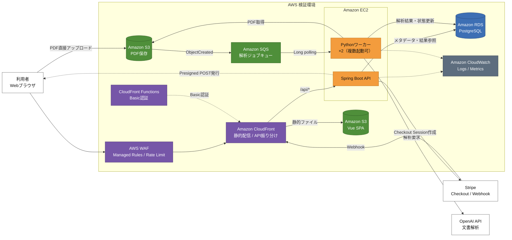

# Hodoku

> 保険の契約書や約款などの難解なPDFを解析し、一般の利用者向けに分かりやすく整理するWebアプリケーションです。
> 主に SPA や AWS の学習目的で開発しました。

## デモ

https://github.com/user-attachments/assets/5ae52aae-1718-4f96-a96d-0aca78f409a9

デモでは、PDFの選択・アップロードから、解析処理、結果表示までの流れを確認できます。

## 検証環境

- URL：`https://d3tqsfxehbet1k.cloudfront.net/#/`
- Basic認証のユーザー名とパスワード、検証用のクレジットカード情報は個別に共有します
- 検証用のクレジットカード番号は「4242 4242 4242 4242」です。メールアドレス、有効期限、セキュリティコード、氏名は何でも構いません。

> [!NOTE]
> 検証環境のため、予告なく停止・再起動する場合があります。また、処理件数や解析結果の精度を制限しています。

## プロジェクト概要

保険約款には専門用語や長い条文が多く、一般の利用者が重要事項や免責条件を把握しにくいという課題があります。

Hodokuは、保険約款のPDFをアップロードするだけで、AIを利用して次のような情報を整理して表示します。

- 文書全体の概要
- 特に確認すべき重要ポイント
- 保険金が支払われない条件などの注意事項
- 誤解しやすい内容
- 条文の平易な日本語での説明

本サービスは、契約内容の理解を補助することを目的としており、法律・保険・税務などの専門的な助言を提供するものではありません。

## 主な機能

| 機能 | 概要 |
| --- | --- |
| PDFアップロード | Presigned POSTを利用し、PDFをAmazon S3へ直接アップロード |
| 非同期解析 | Amazon SQSとPythonワーカーにより、時間のかかるPDF解析を非同期実行 |
| AIによる整理 | PDFから抽出した文章をOpenAI APIで解析し、概要・注意点・誤解しやすい点を生成 |
| 無料・有料表示 | 無料部分と詳細部分を分離し、文書単位で閲覧権限を管理 |
| 都度課金 | Stripe Checkoutを利用した1文書単位の決済 |
| 再閲覧 | 推測困難なアクセストークンを利用し、期限内の結果再表示に対応 |
| 監視 | CloudWatchでアプリケーションログとEC2のメトリクスを収集 |

## システム構成

### 処理の流れ

1. 利用者がCloudFront経由でVueのSPAへアクセスします。
2. Spring Boot APIがPresigned POSTを発行し、ブラウザからS3へPDFを直接アップロードします。
3. S3のオブジェクト作成イベントを契機に、解析ジョブがSQSへ送信されます。
4. EC2上のPythonワーカーがSQSをロングポーリングし、PDFの取得・文字抽出・OpenAI APIによる解析を実行します。
5. 解析結果をRDS PostgreSQLへ保存し、フロントエンドがSpring Boot API経由で結果を取得します。
6. 有料部分の閲覧時はStripe Checkoutで決済し、Webhook受信後に閲覧権限を更新します。

## 担当範囲

個人開発として、全て一人で担当しています。

- Vue 3 / TypeScriptによるフロントエンド実装
- Java 21 / Spring BootによるREST API実装
- PythonによるPDF解析ワーカー実装
- PostgreSQLのテーブル・アクセス制御設計
- SQSを利用した非同期処理の設計・実装
- S3、CloudFront、EC2、RDS、WAFなどのAWS環境構築
- systemdによるAPI・Pythonワーカーのサービス管理
- GitHub ActionsとAWS Systems Managerを利用したデプロイ自動化
- CloudWatchによるログ・CPU・メモリ・ディスク使用率の監視
- Stripe CheckoutとWebhookを利用した決済連携

## 使用技術

| 分類 | 技術 |
| --- | --- |
| フロントエンド | Vue 3、TypeScript、Vite、Pinia、Vue Router |
| バックエンド | Java 21、Spring Boot、Spring Web、Spring Data JPA |
| 解析ワーカー | Python、pdfplumber、OpenAI API |
| データベース | PostgreSQL（Amazon RDS） |
| AWS | CloudFront、S3、EC2、RDS、SQS、WAF、CloudFront Functions、Systems Manager、Parameter Store、CloudWatch |
| CI/CD | GitHub Actions |
| 決済 | Stripe Checkout / Webhook |
| プロセス管理 | systemd |

## 技術的に工夫した点

### 1. 重いPDF解析処理の非同期化

PDFの文字抽出やOpenAI APIの呼び出しには時間がかかるため、Spring BootのHTTPリクエスト内では処理していません。

S3のイベント通知、SQS、Pythonワーカーを組み合わせることで、APIの応答性を維持しながら解析処理を実行する構成にしました。

### 2. Spring BootとPythonの責務分離

- Spring Boot：文書登録、Presigned POST発行、ステータス取得、結果返却、決済処理
- Pythonワーカー：PDF取得、文字抽出、AI解析、解析結果の保存

得意分野の異なる言語を処理単位で分離し、SQSとRDSを介して連携させています。

### 3. Pythonワーカーの並列実行

systemdのテンプレートユニットを利用し、同一EC2インスタンス上で複数のワーカープロセスを起動できる構成にしています。

処理量に応じてワーカー数を変更でき、ログ上でもワーカーを識別できるようにしています。

### 4. PDFをAPIサーバー経由で転送しない設計

Spring BootがPDF本体を受信してS3へ転送するのではなく、ファイルサイズなどの条件を含むPresigned POSTを発行しています。

これにより、EC2のネットワーク・メモリ負荷を抑えながら、アップロード条件をS3側でも検証できます。

### 5. 文書単位のアクセス制御

MVPではログイン機能を設けず、文書IDとは別に推測困難なアクセストークンを発行しています。

トークンは平文でDBへ保存せず、ハッシュ化した値を保存して照合します。また、無料閲覧期限と有料閲覧期限を分けて管理しています。

### 6. 小規模環境を意識したAWS構成

検証段階ではSpring Boot APIとPythonワーカーを1台のEC2へ配置し、RDSのみプライベートサブネットに分離しています。

コストを抑えながら、将来的にSQSのコンシューマーを別EC2やコンテナへ分離できる構成としています。

### 7. 運用・障害対応

- CloudWatch AgentによるアプリケーションログとOSメトリクスの収集
- systemdによる異常終了時の自動再起動
- SQSの可視性タイムアウトを考慮した再試行
- WAFのマネージドルールとレート制限によるアクセス保護
- CloudFront Functionsによる検証環境のBasic認証
- Parameter Storeによる環境変数・機密値の管理

## ソースコードについて

このリポジトリは、システムの概要と動作を紹介するためのポートフォリオ用リポジトリです。

開発用のソースコードとGit履歴は、別のプライベートリポジトリで管理しています。
